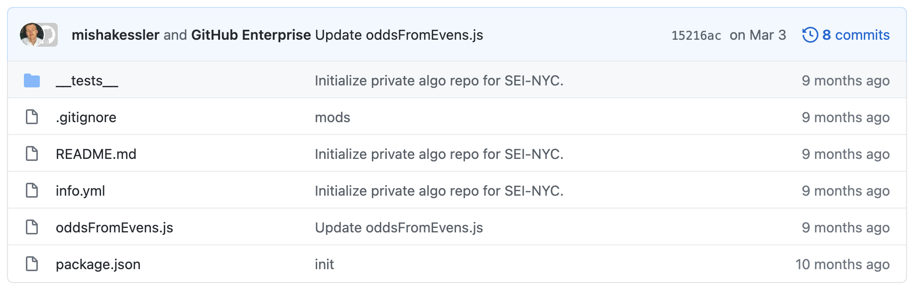
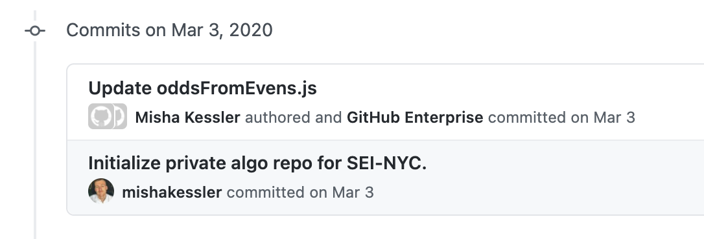
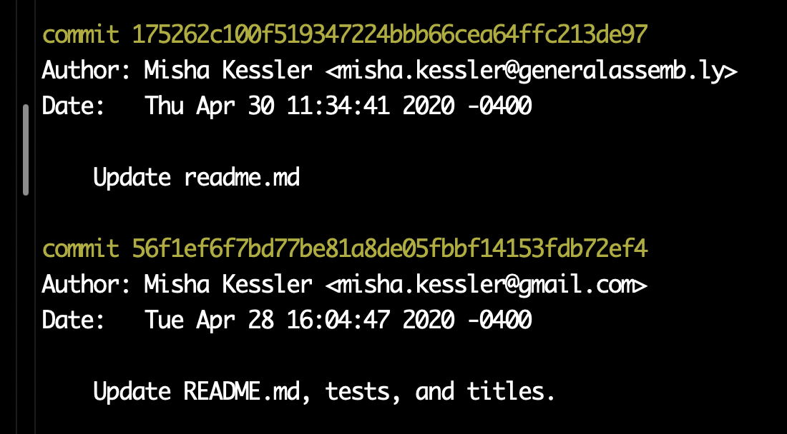
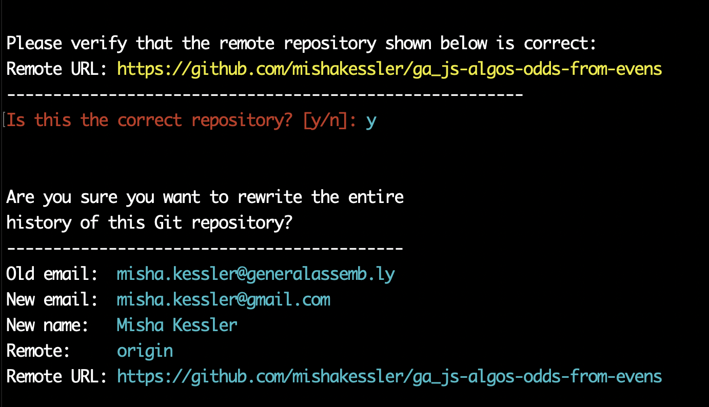
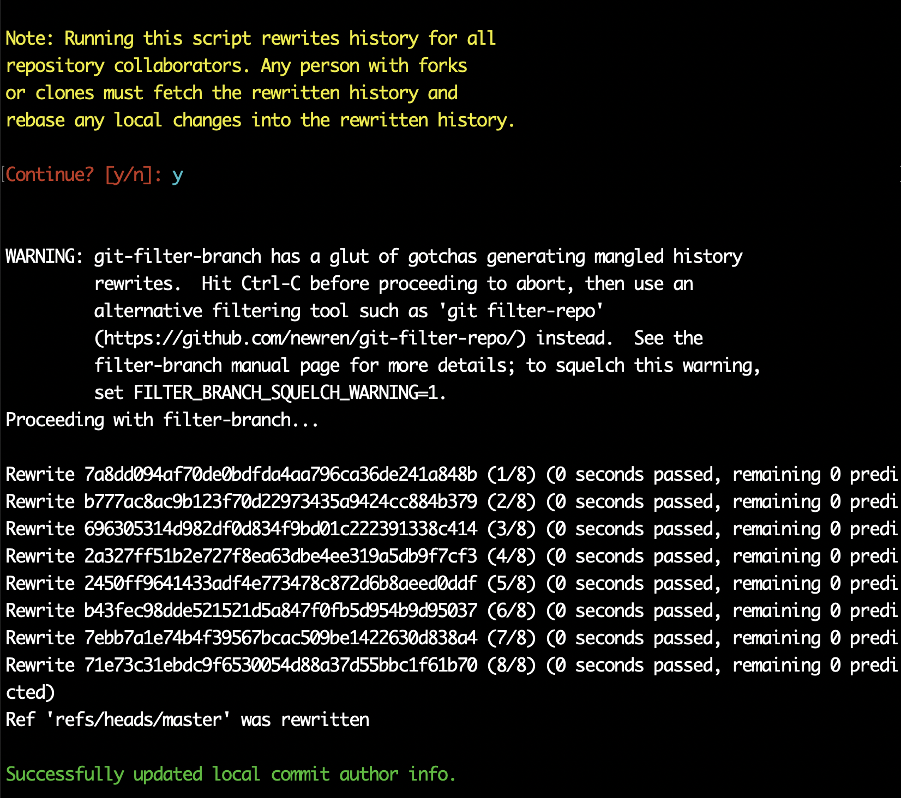
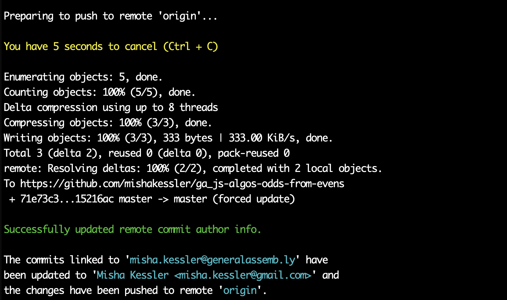

# Commit Authorship Rebasing

Occasionally, you might notice that your commit history isn't crediting you with your own commits. 

Most likely, this happened because either you haven't set up your computer's global git env file– and commits are being made to the working tree with an email address like `misha@mishas-macbook-pro.local`– or you're using different email addresses between your GitHub and GitHub Enterprise accounts.

> Please note, as Adam DeHaven states: This action is destructive to your repository's history. If you're collaborating on a repository with others, it's considered bad practice to rewrite published history, and running this script **will** rewrite history for all repository collaborators. After completing these steps, any person with forks or clones must fetch the rewritten history.

If you are not the only person on your repository, you will need to alert your teammates to the changes made the working tree's history, or issues will arise.

With that out of the way, I've managed to get the bulk of the work down to two terminal commands, so take a look below for an easy solution!

<br>

## Step 1: Confirming Repositories to Rebase

If you suspect you'll need to rebase your repository, check out the commit history by clicking on your `X commits` link in the file explorer.

<div align="center">

</div><br>

If you see multiple commits that aren't linked to your profile, you'll want to update that repository. 

<div align="center">

</div><br>

> For example, this shows commits from `Misha Kessler`, versus commits from `mishakessler`. I want the latter, because this is my GitHub Username.

<br>

## Step 2: Getting Started

First, in your terminal, set up a temporary directory that will allow you to clone the necessary repositories; `cd` into the temporary directory.

```sh
mkdir temp && cd temp
```

<br>

## Step 3: Setting Up Our Script

In the directory, clone the [Change Git Author Script by Adam DeHaven](https://www.adamdehaven.com/blog/update-commit-history-author-information-for-git-repository/); `cd` into the cloned repository.

```sh
git clone https://github.com/adamdehaven/change-git-author && cd change-git-author
```

<br>

Once inside the cloned directory, you need to grant the script file the necessary privileges.

```sh
chmod +x changeauthor.sh
```

<br>

Let's go back up a level to parent `temp` directory.

```sh
cd ..
```

<br>

## Step 4: Cloning Our Repository

With our script ready to go, you'll want to clone the relevant repository into the same `temp` directory as the cloned script; `cd` into that repository.

```sh
git clone <repository link> && cd <cloned repository name>
```

<br>

### Finding The Authorship Information

In order to use this script, we first have to know the _author information_ on the old commits. If you're not sure, run a `git log` so you can browse the commits and see the commit author email.

<div align="center">

</div>

> In this example, we can see that two of my commits are under two different emails. I need my commit author information to have my gmail address, because this is linked to my personal GitHub. With that in mind, let's get to running that script.

<br>

## Step 5: Running Our Rebase Script

Now that we have the old email, we're able to run the full script; from inside the git repository, run the following command, replacing all content inside a `< >` with your information:

```sh
../change-git-author/changeauthor.sh --old-email <misha.kessler@generalassemb.ly> --new-email <misha.kessler@gmail.com> --new-name "<Misha Kessler>" --remote <origin>
```

> Note: Do **not** include the `< >`.

<br>

Let's break down what's happening:

1. We're telling our terminal to access the script at the location provided in the first argument: `../change-git-author/changeauthor.sh`
2. Next, we're giving the script the email that needs to be replaced, which we found by running `git log`. In my case, it's my General Assembly email, but for you, it may be something like `misha@mishas-macbook-pro.local`.
3. Next, we provide the email we need to change the commit to reflect. This should be your personal GitHub email.
4. Next, we need to provide the `--new-name` flag, even if we're not changing the name on our commits. Just put your name in. 
5. Finally, we give the destination name of our remote repository– most likely just your `origin`. This allows us to directly update our remote with our new commit history.

<br>

Once you run this command, your terminal will prompt you twice:

First, confirm the repo's origin URL. 

<div align="center">

</div><br>

Second, confirm that you understand how you're affecting the git history.

<div align="center">

</div><br>

Once confirmed, it will automatically run a `git push` to your remote, automatically updating your rebased history.

<div align="center">

</div><br>

## Voila

That's all! Your commits will now be reflected on your Contribution Graph. 

<br>

<hr>

## Speeding Up The Process (For Rebasing Multiple Repos)

If you have multiple repositories that you want to rebase, remember to use your terminal shortcuts! Once you're done with one rebase, you should still be in that repository's folder. Let's use the same commands to `cd` to our parent directory, clone a _new_ repository, and `cd` into that repository.

```sh
cd .. && git clone <next repository link> && cd <next cloned repository name>
```

<br>

Then, by simply pressing the `up` arrow on our keyboard twice, we'll pull back the script command:

```sh
../change-git-author/changeauthor.sh --old-email <misha.kessler@generalassemb.ly> --new-email <misha.kessler@gmail.com> --new-name "Misha Kessler" --remote <origin>
```

<br>

By repeating this pattern, you can rebase multiple repositories quite quickly.